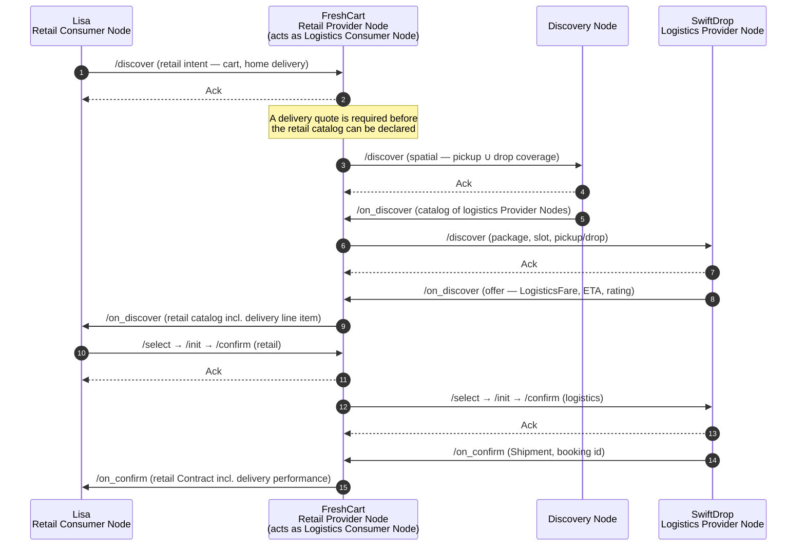
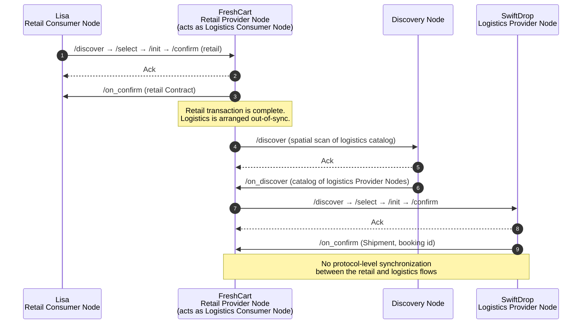
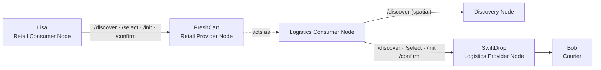
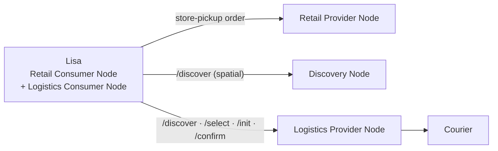
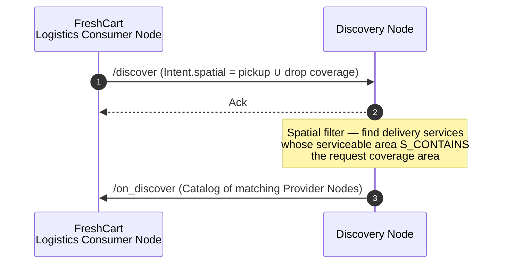
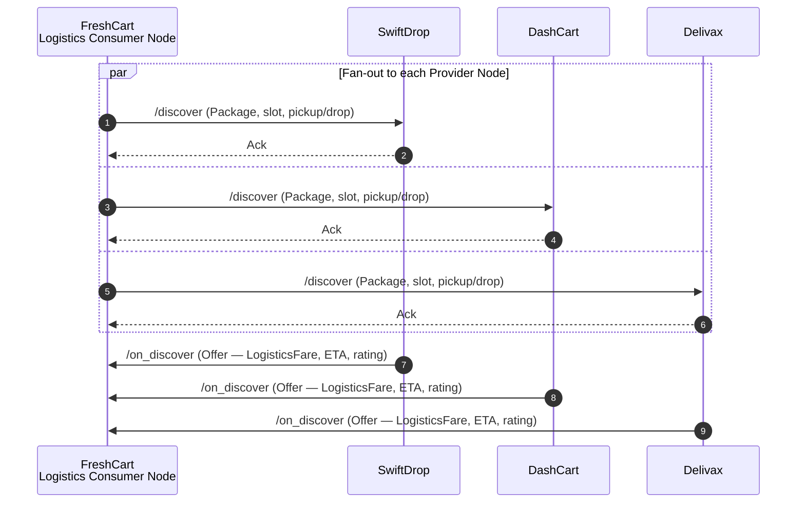

# Implementing Logistics Flows on a Value-exchange Fabric

**A Beckn Protocol V2.0 Implementation Guide**

| | |
|---|---|
| **Status** | Draft |
| **Applies to** | Beckn Protocol `context.version` `2.0.0` |
| **Audience** | Network architects and node implementers building logistics workflows |
| **Normativity** | Non-normative. Illustrative guidance; the canonical authority is `api/v2.0.0/beckn.yaml` and the schema registry at https://schema.beckn.io |

> Copyright © 2026 Networks for Humanity Foundation. Licensed under CC-BY-NC-SA 4.0 International.

---

## Abstract

This document describes how to implement logistics workflows on a Beckn Protocol V2.0 value-exchange fabric. It shows how a logistics transaction progresses through the contract lifecycle — discovery, contracting, performance, and post-performance — and how registered domain schemas (principally the `Logistics` module on the schema registry) compose into the core lifecycle schemas (`Contract`, `Commitment`, `Consideration`, `Performance`, `Settlement`, `Participant`) through the `Attributes` extensibility channel.

The guide works through a hyperlocal grocery delivery as a running example, in which a retail provider node orchestrates a delivery on behalf of a consumer. It covers both the case where the logistics workflow is synchronized with a retail workflow and the case where it runs independently. Throughout, communication is modeled in the Beckn V2.0 manner: each call is acknowledged synchronously with an `Ack` at the transport layer, and business outcomes are declared asynchronously by the implementing node through its `on_*` callback. An `on_*` callback is an independent state declaration by the implementing node, not a reply bound to the request.

---

## Use Case

The logistics flow is implemented as a consequence of a retail flow as it goes through various stages of its contract lifecycle, namely discovery, contracting, performance (fulfillment), and post-performance (post-fulfillment).

As the retail order gets built and ultimately confirmed between a retail Consumer Node and a retail Provider Node, either of the two nodes may make calls as a logistics Consumer Node to logistics Provider Nodes to negotiate and estimate availability, pricing, and other terms. It is to be noted that the retail provider / logistics consumer node may choose to transact with logistics Provider Nodes in-sync with the ongoing retail transaction or out-of-sync with the retail transaction. Beckn Protocol does not assume any sort of synchronization between the retail and logistics workflows of the transaction.

### A logistics workflow synchronized with a retail workflow

In a synchronized workflow, the retail provider resolves logistics before it declares the retail catalog (and, later, the confirmed retail contract) back to the consumer. The delivery line item is therefore present in the retail offer the consumer sees.



### A logistics workflow independent of a retail workflow

In an unsynchronized workflow, the retail transaction completes on its own timeline and the retail provider performs a separate **scan** of logistics out of band. There is no protocol-level coupling between the two flows.



### Nuances of a logistics workflow

Logistics workflows in the hyperlocal delivery sector often calculate pricing on the basis of distance between one area code and another. Warehousing and delivery agents are typically assigned to area codes depending on demand and supply density. So a typical delivery request to estimate pricing does not require exact pickup and drop coordinates; rather, it requires pickup and drop area codes to estimate delivery fees.

When a logistics workflow is orchestrated by the retail provider node, it is usually in response to a "home delivery" order made by the consumer node. In such cases, the retail provider SHOULD assume full liability for the delivery of the order and absorb the cost of any cancellations or reallocations that may occur in the logistics transaction. This is not a mandate but a strong recommendation for better customer experience.

On the other hand, when a logistics workflow is orchestrated by a retail consumer node, it MUST be placed as a "store pickup" order so that the retail provider node does not also book a delivery service, which would lead to two parallel delivery services attempting to pick up the same order. In such a scenario, the node that interpreted the order fulfillment incorrectly MUST cancel the logistics order and absorb the charges for the same.

---

## Implementation Architecture (Non-Normative)

A logistics transaction is modeled as a single `Contract` whose lifecycle phases bind to specific core schemas, each extended with logistics semantics through its `Attributes` channel. The following table maps the schemas used at each stage. All domain schemas listed are registered on https://schema.beckn.io (the `Logistics` module, v2.0) unless noted in **Open Items**.

| Lifecycle stage | Actions | Core schemas | Logistics domain schemas (via `Attributes`) |
|---|---|---|---|
| **Discovery** | `/discover`, `/on_discover` | `Intent` (`spatial`, `filters`), `Catalog`, `Offer`, `Resource` | `Package` (in `resourceAttributes`), `LogisticsFare` (in `offerAttributes`), `CategoryCode` |
| **Contracting** | `/select`, `/init`, `/confirm` (+ `/on_*`) | `Contract`, `Commitment`, `Consideration`, `Participant` | `Package`, `LogisticsFare`, `Consumer`, `LogisticsOperator`, `Courier` |
| **Performance** | `/status`, `/track` (+ `/on_*`) | `Performance` | `Shipment` (nesting `LogisticsRoute`, `Waypoint`, `DeliverySlot`, `Proof`, `TrackingUpdate`) |
| **Post-performance** | `/rate`, `/support`, `/cancel`, `/update` (+ `/on_*`) | `Contract` (`contractAttributes`), `Settlement` | `LogisticsReceipt`, `LogisticsRating`, `LogisticsFeedback`, `LogisticsSupportCase`, `ReturnPolicy` |

> The `Settlement` mapping is intentionally left as a stub in this revision (see **Schema Design** and **Open Items**).

---

## Network Architecture

### Cascaded topology

The logistics network sits *behind* the retail provider. The consumer transacts only with the retail provider; the retail provider, acting as a logistics Consumer Node, transacts with the Discovery Node and the chosen logistics Provider Node. This is the topology used by the running example in this guide.



### Parallel topology

The consumer arranges logistics directly. The consumer holds two simultaneous relationships — one with the retail provider (placed as **store pickup**, per the liability rule above) and one with the logistics network. The two flows have no protocol-level dependency on each other.



---

## Communication Protocol

Every request is answered synchronously with an `Ack` at the transport layer; the business outcome is declared asynchronously by the implementing node on the caller's registered callback endpoint. The endpoints used in a logistics workflow are the standard Beckn V2.0 transaction actions.

| Endpoint | Caller → Implementer | Purpose | Asynchronous callback |
|---|---|---|---|
| `/discover` | Logistics Consumer Node → Discovery Node | Find logistics Provider Nodes whose serviceable area envelopes the request's coverage area (spatial discovery) | `/on_discover` (catalog of matching Provider Nodes) |
| `/discover` | Logistics Consumer Node → Logistics Provider Node | Request an offer (fare, ETA, terms) for the specific package and slot | `/on_discover` (`Offer` with `LogisticsFare`) |
| `/select` | Logistics Consumer Node → Logistics Provider Node | Declare the chosen offer; begin constructing the `Contract` | `/on_select` (priced, validated commitments) |
| `/init` | Logistics Consumer Node → Logistics Provider Node | Provide participant and payment-term details; receive draft terms | `/on_init` (`Consideration`, `PaymentTerms`) |
| `/confirm` | Logistics Consumer Node → Logistics Provider Node | Confirm and book the delivery | `/on_confirm` (`Shipment`, booking id) |
| `/status` | Logistics Consumer Node → Logistics Provider Node | Request current execution state | `/on_status` (`Performance` update) |
| `/track` | Logistics Consumer Node → Logistics Provider Node | Request live tracking | `/on_track` (`TrackingUpdate`) |
| `/rate` | Logistics Consumer Node → Logistics Provider Node | Submit a rating for the service, driver, or carrier | `/on_rate` |
| `/support` | Logistics Consumer Node → Logistics Provider Node | Raise a support case | `/on_support` (`LogisticsSupportCase`) |

> The discovery registry (catalog publication and pull) uses the `catalog/*` family — `catalog/publish`, `catalog/subscription`, `catalog/pull`, `catalog/on_pull` — which is the documented slash-delimited exception to the single-token action convention.

---

## Payload Design

A general logistics request may carry several details, such as:

1. **A service boundary** — a geospatial / geopolitical region that at least covers the pickup and drop location coordinates. For delivery services a typical serviceable boundary can be:
   - an area code (PIN code, ZIP code, or equivalent);
   - a city code (when delivery is between two area codes within a city);
   - a state code (when delivery is between two cities within a state);
   - a country code (when delivery is across cities and states within a country);
   - a circle centered at the pickup location with a radius equal to the pickup-to-drop distance plus a small buffer to avoid edge-exclusion errors at the circle's boundary.
2. **Preferred / not-preferred routes** — shipping lanes, green corridors, avoid war zones.
3. **Preferred providers.**
4. **Package content categories** — e.g. Food, Beverage, Grocery, Electronics, Clothing, Medicine.
5. **Package handling codes and tags** — e.g. Fragile, Flammable, Corrosive, Radioactive, Biohazard.
6. **Package temperature** — e.g. Hot, Cold, Frozen, below 4 °C.
7. **Package handling instructions** — e.g. "Always keep it upright"; "Do not shake"; "Handle with extreme caution"; "Keep it out of sunlight".
8. **Vehicle / fleet requirements** — e.g. 8-wheeler, small two-wheeler.
9. **Shipping container requirements.**
10. **Reputation and credential requirements** — e.g. star rating, reliability, permits.

… and so on.

An object describing such a request can be composed using the following registered schemas:

1. `Location` / `LogisticsPlace`
2. `Route` / `LogisticsRoute`
3. `CategoryCode` *(the registry exposes `CategoryCode`, not a bare `Category` — see **Open Items**)*
4. `Package`
5. `Vehicle` / `LogisticsVehicle`
6. `Consignment` *(stands in for the unregistered `ShippingContainer` — see **Open Items**)*
7. `Credential`

To enable this object to be interpreted in a common (semantically interoperable) manner by multiple nodes of a global value-exchange fabric, any self-describing object SHOULD carry the JSON-LD `@context` in which it is valid. In Beckn V2.0, such interoperable objects are carried in a property of type `Attributes` on the schemas that support it (for example `Resource.resourceAttributes`, `Offer.offerAttributes`, `Performance.performanceAttributes`, `Commitment.commitmentAttributes`, `Consideration.considerationAttributes`, `Participant.participantAttributes`, and `Contract.contractAttributes`).

A discovery `Intent` is the one place where criteria are expressed not through an `Attributes` channel but through the `Intent.spatial` field (one or more `SpatialConstraint`) and the `Intent.filters` field (a JSONPath filter expression evaluated against the indexed catalog).

In the case of a simple hyperlocal grocery delivery, the request can be composed using only a subset — `LogisticsPlace`, `CategoryCode`, and `Package`.

### Discovery Request (spatial) — to the Discovery Node

This is the request a logistics Consumer Node fires at the Discovery Node to find Provider Nodes whose serviceable area wholly envelopes the request's coverage area. The coverage geometry is expressed as a `SpatialConstraint`; the package criteria as a `filters` expression.

```json
{
  "context": {
    "version": "2.0.0",
    "action": "discover",
    "bapId": "freshcart.example.net",
    "bapUri": "https://freshcart.example.net/beckn",
    "transactionId": "5f9d…-txn-001",
    "messageId": "5f9d…-msg-001",
    "timestamp": "2026-06-03T16:30:00.000Z"
  },
  "message": {
    "intent": {
      "spatial": {
        "targets": ["$['serviceableArea'][*]['geo']"],
        "op": "S_CONTAINS",
        "geometry": {
          "type": "Polygon",
          "coordinates": [[
            [77.5921, 12.9719], [77.6005, 12.9719],
            [77.6005, 12.9655], [77.5921, 12.9655],
            [77.5921, 12.9719]
          ]]
        },
        "quantifier": "ANY"
      },
      "filters": {
        "type": "jsonpath",
        "expression": "$[?(@.package.category=='GROCERY' && @.package.handlingCodes anyof ['FRAGILE','FROZEN'])]"
      }
    }
  }
}
```

> `filters.type` is shown as defined in the current draft `beckn.yaml` (`enum: [jsonpath]`). The NFH-005 normalization renaming this to `filters.expressionType` has not yet landed in the draft; this is tracked as a cross-artifact-drift item.

---

## Example Payloads for a Cascaded Delivery Workflow

### Retail Provider (Adam) receives a potential retail order from Retail Consumer (Lisa)

Adam, a retailer (retail provider), receives a notification on his FreshCart app — a quick-commerce store-manager app that helps him receive and manage retail orders from consumers. The notification asks him to estimate inventory availability for a potential order in a consumer's (Lisa's) cart.

The order contains a cart (products with `id`, `name`, `SKU`, `quantity`, thumbnail, add-ons, customizations, item-level discounts, item metadata, offers, and a price breakup excluding taxes, shipping, and convenience), billing details (customer name Lisa Headey, masked phone, email, invoice URL), and a fulfillment method of **Home Delivery**.

Adam then:

1. checks his inventory and confirms the items are available in his store;
2. confirms on his mobile app that the items in the order are available;
3. has his Provider Node (FreshCart) proceed to calculate delivery charges by acting as a logistics Consumer Node.

### Discovery Workflow — spatial discovery against the Discovery Node

To calculate delivery charges, the logistics Consumer Node (FreshCart) first identifies the Provider Nodes around Adam's store that can deliver to Lisa. It does this by firing a spatial `/discover` at the Discovery Node. The Discovery Node performs a spatial filtering of the serviceable areas of all delivery services in its catalog against the request's coverage area; a match is a delivery service whose serviceable area wholly envelopes the request's coverage area.



The request is the **Discovery Request (spatial)** payload shown above. The callback returns a `Catalog` listing the matching Provider Nodes:

```json
{
  "context": {
    "version": "2.0.0",
    "action": "on_discover",
    "transactionId": "5f9d…-txn-001",
    "messageId": "5f9d…-msg-001",
    "timestamp": "2026-06-03T16:30:00.420Z"
  },
  "message": {
    "catalog": {
      "descriptor": { "name": "Serviceable delivery providers" },
      "providers": [
        { "id": "swiftdrop.example.net", "descriptor": { "name": "SwiftDrop" } },
        { "id": "dashcart.example.net",  "descriptor": { "name": "DashCart" } },
        { "id": "delivax.example.net",   "descriptor": { "name": "Delivax" } }
      ]
    }
  }
}
```

### Delivery Services requested for all providers

The logistics Consumer Node now fires an individual `/discover` at each Provider Node returned by the Discovery Node, this time carrying the concrete package and slot so each can return a priced `Offer`.



The per-provider `/discover` carries the package details in `resourceAttributes` (a `Package`) and the coverage in `Intent.spatial`:

```json
{
  "context": {
    "version": "2.0.0",
    "action": "discover",
    "bapId": "freshcart.example.net",
    "bppId": "swiftdrop.example.net",
    "transactionId": "5f9d…-txn-001",
    "messageId": "5f9d…-msg-002",
    "timestamp": "2026-06-03T16:30:01.000Z"
  },
  "message": {
    "intent": {
      "spatial": {
        "targets": ["$['serviceableArea'][*]['geo']"],
        "op": "S_CONTAINS",
        "geometry": { "type": "Point", "coordinates": [77.5946, 12.9716] },
        "distanceMeters": 4200
      },
      "filters": {
        "type": "jsonpath",
        "expression": "$[?(@.deliveryWindowMinutes <= 15)]"
      }
    },
    "resource": {
      "descriptor": { "name": "Grocery order — 14 items" },
      "resourceAttributes": {
        "@context": "https://schema.beckn.io/Package/v2.0/context.jsonld",
        "@type": "Package",
        "category": "GROCERY",
        "handlingCodes": ["FRAGILE", "FROZEN"],
        "weight": { "value": 7, "unit": "kg" },
        "itemCount": 14,
        "instructions": ["Keep frozen items below 0 °C in transit"]
      }
    }
  }
}
```

The callback from each provider returns an `Offer` carrying a `LogisticsFare` in `offerAttributes`:

```json
{
  "context": {
    "version": "2.0.0",
    "action": "on_discover",
    "bppId": "swiftdrop.example.net",
    "transactionId": "5f9d…-txn-001",
    "messageId": "5f9d…-msg-002",
    "timestamp": "2026-06-03T16:30:01.480Z"
  },
  "message": {
    "catalog": {
      "offers": [{
        "id": "offer-swiftdrop-001",
        "descriptor": { "name": "Express grocery delivery" },
        "offerAttributes": {
          "@context": "https://schema.beckn.io/LogisticsFare/v2.0/context.jsonld",
          "@type": "LogisticsFare",
          "currency": "USD",
          "value": "3.40",
          "etaMinutes": 14,
          "rating": 4.7
        }
      }]
    }
  }
}
```

### Delivery charges calculated for the desired service

On receiving the offers from SwiftDrop, DashCart, and Delivax — each with a fare, ETA, rating, and reputation — FreshCart selects the most reliable one (SwiftDrop), adds the delivery charge to the total cart value, and returns the updated retail catalog to Lisa. The package and delivery context FreshCart used to obtain these offers was: package = groceries (some items fragile; some, such as ice cream, must remain frozen in transit), approximate weight 7 kg, item count 14; delivery time window 15 minutes; pickup at Adam's store (GPS coordinates and address — the address is needed for area-code-based charge calculation); drop at Lisa's location (GPS coordinates, no address); delivery tip USD 2.

### Delivery offers selected and retail order finalized

FreshCart declares the chosen logistics offer with `/select`, which begins constructing the logistics `Contract`. In parallel, the retail catalog returned to Lisa now carries the delivery line item so she can review the full price.

```json
{
  "context": {
    "version": "2.0.0",
    "action": "select",
    "bapId": "freshcart.example.net",
    "bppId": "swiftdrop.example.net",
    "transactionId": "5f9d…-txn-001",
    "messageId": "5f9d…-msg-003",
    "timestamp": "2026-06-03T16:31:00.000Z"
  },
  "message": {
    "contract": {
      "descriptor": { "name": "Hyperlocal grocery delivery" },
      "commitments": [{
        "offer": { "id": "offer-swiftdrop-001", "resourceIds": ["pkg-001"] },
        "resources": [{
          "id": "pkg-001",
          "resourceAttributes": {
            "@context": "https://schema.beckn.io/Package/v2.0/context.jsonld",
            "@type": "Package",
            "category": "GROCERY",
            "handlingCodes": ["FRAGILE", "FROZEN"],
            "weight": { "value": 7, "unit": "kg" },
            "itemCount": 14
          }
        }]
      }]
    }
  }
}
```

The provider returns `/on_select` confirming the commitment and priced consideration (`LogisticsFare` in `considerationAttributes`).

### Consumer pays and confirms the order

Lisa reviews the finalized cart (items, offers, total cart value, price breakup including taxes, shipping, and convenience, payment transaction id, final order value, billing details, fulfillment type Home Delivery, delivery address, and delivery request "Do not ring the door bell") and pays. FreshCart confirms the retail order to Lisa and, in the same window, drives the logistics contract to `/confirm`.

```json
{
  "context": {
    "version": "2.0.0",
    "action": "confirm",
    "bapId": "freshcart.example.net",
    "bppId": "swiftdrop.example.net",
    "transactionId": "5f9d…-txn-001",
    "messageId": "5f9d…-msg-004",
    "timestamp": "2026-06-03T16:32:00.000Z"
  },
  "message": {
    "contract": {
      "participants": [
        { "participantAttributes": { "@type": "Consumer", "name": "FreshCart (on behalf of Lisa)" } },
        { "participantAttributes": { "@type": "LogisticsOperator", "name": "SwiftDrop" } }
      ],
      "consideration": [{
        "considerationAttributes": {
          "@context": "https://schema.beckn.io/LogisticsFare/v2.0/context.jsonld",
          "@type": "LogisticsFare",
          "currency": "USD",
          "value": "3.40"
        }
      }],
      "settlements": [{
        "_comment": "Settlement modeling deferred — see Open Items.",
        "considerationId": "consideration-001"
      }]
    }
  }
}
```

### Retail order packed and delivery initiated

The Provider Node (FreshCart) sends Adam another notification to re-estimate inventory availability for the same order. This re-estimation is performed at each step until Lisa pays for the complete order and confirms. Adam checks his inventory and confirms the items are still available. FreshCart then asks him to block the inventory so it is not sold to someone else, and to begin packing. Adam sets the items aside and/or marks them as blocked in his POS or mobile app. With the inventory blocked, FreshCart proceeds to confirm and returns the final order to the Consumer Node for review (order id, cart details, offer details, total cart value, checkout details including price breakup and payment transaction id and final order value, billing details, fulfillment type Home Delivery, delivery address, delivery request "Do not ring the door bell", and a delivery status of "Order packed and ready for delivery").

### Delivery details and payment terms received from delivery service

Following `/on_select`, FreshCart calls `/init` to exchange participant and payment-term details and receive the provider's draft terms. The provider's `/on_init` returns the `Consideration` and `PaymentTerms`.

```json
{
  "context": {
    "version": "2.0.0",
    "action": "on_init",
    "bppId": "swiftdrop.example.net",
    "transactionId": "5f9d…-txn-001",
    "messageId": "5f9d…-msg-005",
    "timestamp": "2026-06-03T16:31:30.000Z"
  },
  "message": {
    "contract": {
      "consideration": [{
        "considerationAttributes": {
          "@type": "LogisticsFare", "currency": "USD", "value": "3.40",
          "breakup": [
            { "title": "Base freight", "value": "2.80" },
            { "title": "Cold-handling surcharge", "value": "0.40" },
            { "title": "Tip", "value": "0.20" }
          ]
        }
      }],
      "paymentTerms": { "settlementWindow": "P1D", "method": "PREPAID" }
    }
  }
}
```

> Note: the order can sometimes arrive in two shipments, which requires notifying the seller (Adam) to split the package into two shipments. This SHOULD happen before confirmation; in rare cases it happens after. This split case is out of scope for this revision.

### Delivery service confirmation requested

FreshCart pays for the chosen delivery service and confirms the booking, providing additional details such as the delivery address and phone number: order time 16:30; package details (groceries, some items fragile, some to remain frozen in transit, approximate weight 7 kg, item count 14); billing details (store name, phone, email); delivery checkout details (charges breakup, total delivery service value including taxes); payment details (transaction id of the payment made to the delivery service provider, seller payment endpoint, bank account details); pickup details (location address and GPS coordinates; instruction "Order to be collected from the delivery counter behind shop no. 44 — call store if needed"; authorization code 687331); and drop details (location address and GPS coordinates; drop-by 16:45; instruction "Do not ring the doorbell"; authorization "Call customer once arrived at apartment gate for authorization code"; delivery tip USD 2).

### Delivery booking confirmed

SwiftDrop confirms the booking with `/on_confirm`, creates a booking id, and begins searching for drivers. The callback carries the `Shipment` in `performance[].performanceAttributes`, with the route nested inside it.

```json
{
  "context": {
    "version": "2.0.0",
    "action": "on_confirm",
    "bppId": "swiftdrop.example.net",
    "transactionId": "5f9d…-txn-001",
    "messageId": "5f9d…-msg-006",
    "timestamp": "2026-06-03T16:32:30.000Z"
  },
  "message": {
    "contract": {
      "id": "contract-001",
      "status": { "code": "ACTIVE" },
      "performance": [{
        "performanceAttributes": {
          "@context": "https://schema.beckn.io/Shipment/v2.0/context.jsonld",
          "@type": "Shipment",
          "bookingId": "SD-546453",
          "orderId": "546453",
          "deliverySlot": { "start": "2026-06-03T16:35:00Z", "end": "2026-06-03T16:45:00Z" },
          "route": {
            "@type": "LogisticsRoute",
            "origin":      { "@type": "LogisticsPlace", "address": "Shop no. 44", "geo": [77.5946, 12.9716] },
            "destination": { "@type": "LogisticsPlace", "geo": [77.5962, 12.9698] }
          }
        }
      }],
      "contractAttributes": {
        "@context": "https://schema.beckn.io/LogisticsReceipt/v2.0/context.jsonld",
        "@type": "LogisticsReceipt",
        "receiptId": "rcpt-001"
      }
    }
  }
}
```

### Dispatch and Fulfillment

SwiftDrop dispatches the order to a delivery agent (Bob), sharing the pickup address, drop address, weight, payout, and acceptance deadline; Bob accepts. SwiftDrop notifies Lisa with the agent's name, photo, vehicle registration, rating, ETA, and live location.

During fulfillment, SwiftDrop alerts Adam to the agent's imminent arrival. Bob confirms pickup with a timestamp and a pickup photo (package, label, seal); SwiftDrop relays the pickup status to Adam. On drop approach, Bob calls Lisa for the floor and flat number, presents the delivery QR, and submits a drop photo (recipient, package, doorstep); Lisa confirms delivery with a timestamp. SwiftDrop confirms delivered status, payout, and settlement to Bob. SwiftDrop and FreshCart notify Lisa of the delivered status and timestamp, and FreshCart emails Lisa a receipt (items, total, timestamp, drop-photo thumbnail). These interactions are carried as `TrackingUpdate` and `Proof` objects nested within the `Shipment`, surfaced to the Consumer Node through `/on_status` and `/on_track`.

### Rating

Through `/rate` and `/on_rate`, SwiftDrop prompts Adam, who submits four stars with the tag "slight delay"; SwiftDrop prompts Bob, who submits five stars with the tag "ready at door"; FreshCart prompts Lisa, who submits five stars with tags "fast" and "friendly" (for Bob) and four stars with the note "bruised apple" (for Adam). These are carried as `LogisticsRating` and `LogisticsFeedback`.

### Support

Through `/support` and `/on_support`, carried as `LogisticsSupportCase`: Adam reports a duplicate charge (booking id, amount); SwiftDrop acknowledges with a ticket id and later notifies Adam of the resolution, refund amount, and wallet balance. Bob reports a pending payout (job id); SwiftDrop notifies Bob of the released payout amount. Lisa reports a missing item (order id, item, price); FreshCart notifies Lisa of the refund amount, payment method, apology credit, and corrected total.

---

## Schema Design

A logistics `Contract` composes the registered logistics domain schemas into the core lifecycle schemas through their `Attributes` channels. The canonical mapping is:

| # | Core location | Logistics schema | Registered |
|---|---|---|---|
| 1 | `commitments[0].commitmentAttributes` | `Package` | ✓ |
| 2 | `participants[0].participantAttributes` | `Consumer` | ✓ |
| 3 | `participants[1].participantAttributes` | `LogisticsOperator` | ✓ |
| 4 | `participants[2].participantAttributes` | `Courier` | ✓ |
| 5 | `consideration[0].considerationAttributes` | `LogisticsFare` | ✓ |
| 6 | `performance[0].performanceAttributes` | `Shipment` (nesting `LogisticsRoute`) | ✓ |
| 7 | `contractAttributes` | `LogisticsReceipt` | ✓ |
| 8 | `settlements[]` | *(stub — deferred)* | ✗ |

All eight domain schemas referenced above are registered on https://schema.beckn.io (`Logistics` module, v2.0), except the `Settlement` mapping, which is deliberately left empty in this revision.

### Refinements to validate against `beckn.yaml` (draft)

These are spec-grounded observations on the mapping above; they do not change the canonical mapping but are flagged for review:

- **Package placement.** `Commitment` composes a `resources` array (`Resource`) plus an `offer`, and `Package` maps to `beckn:Item`. The most spec-aligned placement is therefore `commitments[].resources[].resourceAttributes` (as used in the worked-example payloads), with `commitmentAttributes` reserved for commitment-level logistics terms (e.g. handling SLA, liability split). The table retains `commitmentAttributes` as the declared mapping pending a decision.
- **LogisticsFare appears twice.** During discovery the fare estimate rides in `Offer.offerAttributes`; during contracting the agreed value rides in `Contract.consideration[].considerationAttributes`. Both are intentional and represent different lifecycle states of the same value.
- **Shipment subsumes detail.** Because `Shipment` (→ `beckn:Fulfillment`, 25 properties) already nests route, waypoints, delivery slot, proof, and tracking, much of the per-step narrative detail consolidates inside the single `performanceAttributes` object rather than floating as separate attributes.

---

## Open Items

1. **`Settlement` flow** — modeling deferred; `settlements[]` is present as an empty stub. To be designed with `Settlement`, `SettlementTerm`, and `Payment` covering consumer payment, provider payout, and refund discharge.
2. **`Category`** — the registry exposes `CategoryCode` (v2.0 and v2.1), not a bare `Category`. This guide uses `CategoryCode`. Confirm or design `Category`.
3. **`ShippingContainer`** — not registered. This guide maps containerized requirements to `Consignment` and treats `ShippingContainer` as out of scope for the hyperlocal example. Decide: drop, map to `Consignment`/`TransportObject`, or design a new schema.
4. **`Package` placement** — `commitmentAttributes` vs `resourceAttributes` (see Refinements).
5. **Cross-artifact drift** — `filters.type` (draft `beckn.yaml`) vs the NFH-005 `filters.expressionType` normalization. Raise as a separate issue.
6. **Split-shipment case** — a single order arriving as two shipments (notifying the seller to split the package) is noted but out of scope here.
